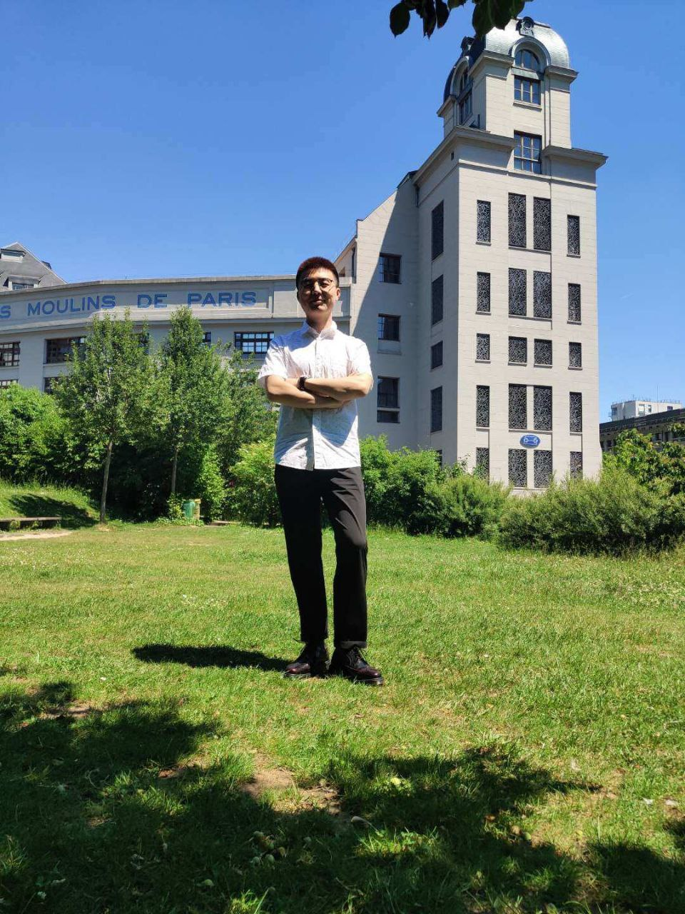
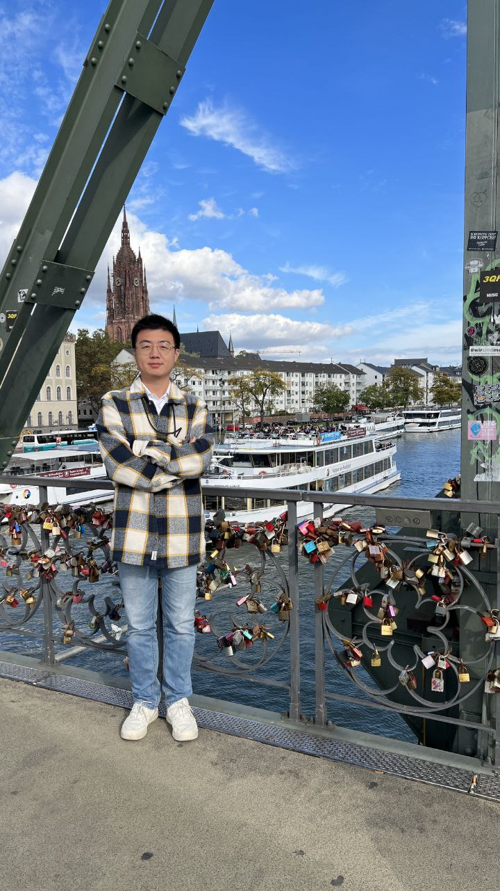

# 时间正好，就差缘分了。

## 寻找一位能够组建幸福家庭的终身制合伙人，在法国最好。
1. 交往是以组建家庭为目的，恋爱是比不可少的过程。
2. **精神和身体都健康，人品性格好**，三观我们可以聊聊看。
3. 希望我们有相同的价值观以及共同的人生目标。
4. 开始一段亲密关系的必要条件: 1. 相互喜欢欣赏 2. 合适，现实原因
5. **真诚，喜欢那些丑话说到前面的**。如果觉得不合适，直接说就好，给打直球的点赞。
6. 希望你和我一样，是个自控以及自律的人，而不是欲望的奴隶。
7. 推进关系过程中，你不主动那我主动。文字聊天很容易产生误解，真的愿意**见面聊聊**。

## 0容忍，零容忍
1. 毒品，赌博，背叛，不诚信。
2. 男闺蜜多的我是理解不了。
3. 冷暴力，遇事逃避不沟通的就算了。
4. 有冲突时口不择言，骂人，骂父母。

## 关于我,一个上进的普通人。

0. 我叫李想，但没理想，面向工资编程的工程师。
1. 92年，开封人，在法国巴黎工作，程序员，未来也是程序员，工作稳定，收入中上。父母身体健康，为人热情开朗，会全力支持我的选择。
2. 法国买过一个studio 29平，希望将来两人一起努力买个别墅，或者大一点房子。
3. 理工直男，有责任心，三观正，人品好，情绪稳定，也耐得住寂寞。不知道该说什么的时候会直接告诉你话题超纲了。
4. 如果你好奇为什么我一直没谈：一生清贫怎敢入繁华，两袖清风怎敢误佳人。认为只有奋斗到小康才能开始，其实不用啊，两人一起奋斗多好啊！
5. 不赌博不嫖娼不抽烟。很少喝酒。会借游戏消愁。
6. 最近走出舒适区，多认识人，计划去London，Tokyo和Osaka，New York和Los Angeles。希望两人一起探索世界。

7. 人生观: 只卷自己，绝不躺平，不会长时间游戏或迷茫。终身学习，终身成长。保持自己身心健康，用积极的心态去激励身边的人。顺便附上我喜欢的一段话: 成为现代的人，就是将个人和社会的生活体验为一个大漩涡，在不断的崩解和重生，麻烦和痛苦，模棱两可和矛盾之中找到自己的世界和自我，成为一个现在主义者，就是让自己在某种程度上在这个大漩涡中宾至如归，跟上它的节奏，在它的潮流内寻求它那猛烈而危险的大潮所允许的实在，美，自由和正义。
8. 价值观: 
    - 诚实正直。和最亲密的人坦诚相待。我的表达很直接，也在学习如何诚实而又不伤人的表达方式。
    - 没有绝对的公平，但追求公平，每个人心中都有一杆秤，希望咱俩的差不多。
    - 责任和奉献。做一个负责的人，不逃避。愿意为家庭付出。
    - 积极进取。保持积极向上的态度，追求个人成长和进步，一起克服困难。
    - 我当自卑视己，切勿狂妄自大。
9. 世界观: 我们可以谈谈看。
10. 金钱观: 
    - 经济独立，节制和理性消费。
    - 储蓄很重要，投资的话看有没有多余的现金流。
    - 诚信和道德，钱干净。
    - 创建一套适合两人的金钱管理策略，婚姻论财 夫妻之道。

## 兴趣爱好

1. 学习，不断学习新技术，算法，系统设计，AI，不被社会所淘汰。
2. 跳舞，Tango， 好久没跳了。喜欢探戈源于电影闻香识女人，Scent of a Women 1992。 希望你也喜欢，一起学，一起跳到老。
3. 读书，随着境界与阅历的增长，一些书中所讲才会有共鸣。《一切坚固的东西都烟消云散了》《风景中的人类》
4. 一直没怎么旅游，一个人不想，两个人看风景更好。
5. 蓝光电影。

## 这里分享的是一些我相信的理念，我不是原创。

1. 真正的爱是一种责任，是一种彼此的牺牲，是一种彼此的成就，彼此尊重。一定是从心里发出的，一定是愿意承担责任的，一定是不单求自己的好，也要求对方好的爱。
（我不希望另一半为我牺牲什么。但如果有必要，我可以为家庭妥协，或是辅助另一半）
2. 钱很重要，经济独立是最起码的标准。双向奔赴确认关系之后，两人应该共同付出浇灌这颗刚生根的种子。两个人需要有一个共同的”爱情账户“，两人得都往里存钱，光一个人存是不行的，迟早会失衡。
（都是没有血缘又想走向超越血缘，你又为这个过程努力了多少呢,你又为你们的爱情账户存了多少财富呢？）
3. 真正的专一，不是一生只爱一个人，而是和谁在一起只爱TA。 我从高中以后就一直单着，所以我喜欢的姑娘是什么样，我只能回答是你的样子。我情商不怎么高，但学习的能力很强。
4. 亲密关系里，物质，情绪价值，时间精力等互相付出，互相珍惜照顾，这是基本的。男女朋友，丈夫妻子，权利和义务同时存在。
5. 维系任何人际关系的本质都是利益交换价值交换，但请让这种交换伴随着感情，感性。如果你赤裸裸地来权衡利弊，把人当工具使用，把情谊当商品交易。

## 婚姻，相互信任，坚守底线

1. 相互信任，并且坚守底线。
2. 我是非丁克。我认为经营家庭，经营婚姻，一起繁衍后代，一起教育子女，家庭传承等是我人生不可缺少的环节。
3. 爱情和婚姻都不是生命的全部。好的关系和好的伴侣可以滋养你的生活和事业。单身可以在这个世界上过得不错，如果我们有彼此的存在，我们可以遇见更好的我们，更高的认知，可以触及到更丰富的生命层次。

## 联系我 邮箱 xiangli1105@hotmail.com

